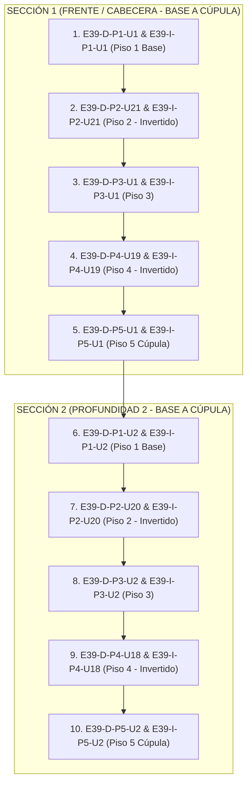

# Secuencia de Armado de una Estiba desde 0 (Simetría Inversa con Desarmado)

Este documento detalla la **secuencia física exacta de las primeras 20 posiciones (10 parejas de tambores)** para construir/armar una estiba de miel desde cero (ejemplo `E39`), demostrando cómo el proceso de **Armado** es la **inversa perfecta del Desarmado** (Estructura tipo Pila / Stack LIFO).

---

## 1. Regla de Simetría Inversa (Armado vs. Desarmado)

En la operativa física de depósito:
*   **Desarmado (Cúpula a Base por Sección)**: Desmonta desde la cúpula superior del frente hacia el piso base:
    `P5-U1` $\rightarrow$ `P4-U19` $\rightarrow$ `P3-U1` $\rightarrow$ `P2-U21` $\rightarrow$ `P1-U1`.
*   **Armado (Base a Cúpula por Sección)**: Construye desde el piso base del frente elevándose hasta la cúpula:
    `P1-U1` $\rightarrow$ `P2-U21` $\rightarrow$ `P3-U1` $\rightarrow$ `P4-U19` $\rightarrow$ `P5-U1`.

Una vez completada la **Sección 1 (Cabecera Frente)** hasta el Piso 5, el autoelevador retrocede un paso y construye la **Sección 2** (`P1-U2` $\rightarrow$ `P2-U20` $\rightarrow$ `P3-U2` $\rightarrow$ `P4-U18` $\rightarrow$ `P5-U2`).

---

## 2. Lista Exacta de las Primeras 20 Posiciones (10 Pares) para Armar desde 0

### Detalle de las 20 Posiciones en Orden Inverso Exacto:

| N° Orden | Posición Exacta en Sistema | Piso / Elevación | Lado | Ubicación (`U`) | Sección Operativa |
| :---: | :---: | :---: | :---: | :---: | :---: |
| **1** | `E39-D-P1-U1` | **Piso 1 (Base)** | Derecho | `U1` | **Sección 1 (Base Frente)** |
| **2** | `E39-I-P1-U1` | **Piso 1 (Base)** | Izquierdo | `U1` | **Sección 1 (Base Frente)** |
| **3** | `E39-D-P2-U21` | **Piso 2** | Derecho | `U21` (Invertido) | **Sección 1 (Elevación 2)** |
| **4** | `E39-I-P2-U21` | **Piso 2** | Izquierdo | `U21` (Invertido) | **Sección 1 (Elevación 2)** |
| **5** | `E39-D-P3-U1` | **Piso 3** | Derecho | `U1` | **Sección 1 (Elevación 3)** |
| **6** | `E39-I-P3-U1` | **Piso 3** | Izquierdo | `U1` | **Sección 1 (Elevación 3)** |
| **7** | `E39-D-P4-U19` | **Piso 4** | Derecho | `U19` (Invertido) | **Sección 1 (Elevación 4)** |
| **8** | `E39-I-P4-U19` | **Piso 4** | Izquierdo | `U19` (Invertido) | **Sección 1 (Elevación 4)** |
| **9** | `E39-D-P5-U1` | **Piso 5 (Cúpula)** | Derecho | `U1` | **Sección 1 (Cúpula Frente)** |
| **10** | `E39-I-P5-U1` | **Piso 5 (Cúpula)** | Izquierdo | `U1` | **Sección 1 (Cúpula Frente)** |
| **11** | `E39-D-P1-U2` | **Piso 1 (Base)** | Derecho | `U2` | **Sección 2 (Base Profundidad 2)** |
| **12** | `E39-I-P1-U2` | **Piso 1 (Base)** | Izquierdo | `U2` | **Sección 2 (Base Profundidad 2)** |
| **13** | `E39-D-P2-U20` | **Piso 2** | Derecho | `U20` (Invertido) | **Sección 2 (Elevación 2)** |
| **14** | `E39-I-P2-U20` | **Piso 2** | Izquierdo | `U20` (Invertido) | **Sección 2 (Elevación 2)** |
| **15** | `E39-D-P3-U2` | **Piso 3** | Derecho | `U2` | **Sección 2 (Elevación 3)** |
| **16** | `E39-I-P3-U2` | **Piso 3** | Izquierdo | `U2` | **Sección 2 (Elevación 3)** |
| **17** | `E39-D-P4-U18` | **Piso 4** | Derecho | `U18` (Invertido) | **Sección 2 (Elevación 4)** |
| **18** | `E39-I-P4-U18` | **Piso 4** | Izquierdo | `U18` (Invertido) | **Sección 2 (Elevación 4)** |
| **19** | `E39-D-P5-U2` | **Piso 5 (Cúpula)** | Derecho | `U2` | **Sección 2 (Cúpula Profundidad 2)** |
| **20** | `E39-I-P5-U2` | **Piso 5 (Cúpula)** | Izquierdo | `U2` | **Sección 2 (Cúpula Profundidad 2)** |

---

> [!IMPORTANT]
> Esta secuencia demuestra la **simetría perfecta LIFO (Pila)**:
> *   La primera pareja colocada en el desarmado (`P5-U1`) es la última colocada en el armado de la Sección 1.
> *   La última pareja en retirarse en el desarmado (`P1-U1`) es la primera colocada al armar desde 0.
