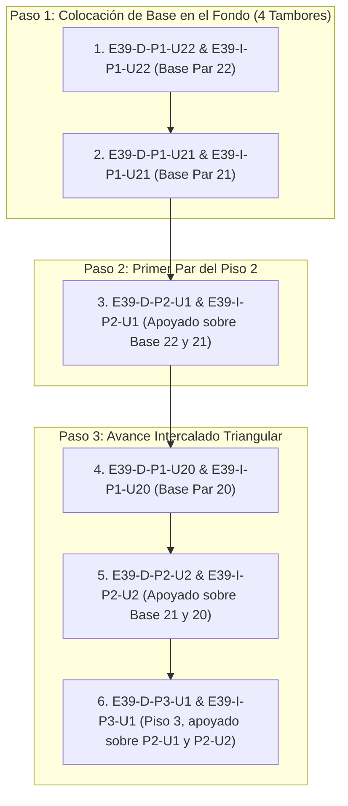

# Secuencia Real de Armado de Estivas (Regla de 4 Tambores de Base)

Este documento detalla la **secuencia física exacta de las primeras 20 posiciones (10 parejas de tambores)** para construir/armar una estiba de miel desde cero (ejemplo `E39`), incorporando la **Regla de Apoyo de 4 Tambores de Base** requerida para colocar cualquier celda en elevación.

---

## 1. Regla Física de Apoyo (4 Tambores de Base por 1 Par Superior)

Físicamente, los tambores de miel son cilíndricos y pesados. Para colocar un par de tambores en un piso elevado (ej. Piso 2), este **debe apoyarse sobre el valle/cuna que forman 2 pares contiguos (4 tambores de base)** del piso inferior.

*   Para apoyar **`E39-D-P2-U1` y `E39-I-P2-U1`** (Piso 2), se requiere tener colocados previamente:
    1.  `E39-D-P1-U22` y `E39-I-P1-U22` (Par Base 22 del Piso 1)
    2.  `E39-D-P1-U21` y `E39-I-P1-U21` (Par Base 21 del Piso 1)
*   **Total de Tambores de Base Requeridos**: 4 tambores (2 parejas del Piso 1).

---

## 2. Lista Exacta de las Primeras 20 Posiciones (10 Pares) para Armar desde 0

### Detalle Secuencial de las 20 Posiciones:

| N° Orden | Posición Exacta en Sistema | Nivel / Elevación | Lado | Ubicación (`U`) | Función Física en el Armado |
| :---: | :---: | :---: | :---: | :---: | :---: |
| **1** | `E39-D-P1-U22` | **Piso 1 (Base)** | Derecho | `U22` | Base Par 22 (Primeros 2 tambores en suelo) |
| **2** | `E39-I-P1-U22` | **Piso 1 (Base)** | Izquierdo | `U22` | Base Par 22 (Compañero) |
| **3** | `E39-D-P1-U21` | **Piso 1 (Base)** | Derecho | `U21` | Base Par 21 (Forma el valle de 4 tambores) |
| **4** | `E39-I-P1-U21` | **Piso 1 (Base)** | Izquierdo | `U21` | Base Par 21 (Compañero) |
| **5** | `E39-D-P2-U1` | **Piso 2** | Derecho | `U1` | **Primer Par de Piso 2 (Apoyado sobre 4 de base)** |
| **6** | `E39-I-P2-U1` | **Piso 2** | Izquierdo | `U1` | **Compañero de Piso 2** |
| **7** | `E39-D-P1-U20` | **Piso 1 (Base)** | Derecho | `U20` | Base Par 20 (Habilita cuna para P2-U2) |
| **8** | `E39-I-P1-U20` | **Piso 1 (Base)** | Izquierdo | `U20` | Base Par 20 (Compañero) |
| **9** | `E39-D-P2-U2` | **Piso 2** | Derecho | `U2` | Segundo Par de Piso 2 (Apoyado en P1-U21/U20) |
| **10** | `E39-I-P2-U2` | **Piso 2** | Izquierdo | `U2` | Compañero de Piso 2 |
| **11** | `E39-D-P3-U1` | **Piso 3** | Derecho | `U1` | **Primer Par de Piso 3 (Apoyado sobre P2-U1/U2)** |
| **12** | `E39-I-P3-U1` | **Piso 3** | Izquierdo | `U1` | **Compañero de Piso 3** |
| **13** | `E39-D-P1-U19` | **Piso 1 (Base)** | Derecho | `U19` | Base Par 19 (Habilita cuna para P2-U3) |
| **14** | `E39-I-P1-U19` | **Piso 1 (Base)** | Izquierdo | `U19` | Base Par 19 (Compañero) |
| **15** | `E39-D-P2-U3` | **Piso 2** | Derecho | `U3` | Tercer Par de Piso 2 (Apoyado en P1-U20/U19) |
| **16** | `E39-I-P2-U3` | **Piso 2** | Izquierdo | `U3` | Compañero de Piso 2 |
| **17** | `E39-D-P3-U2` | **Piso 3** | Derecho | `U2` | Segundo Par de Piso 3 (Apoyado en P2-U2/U3) |
| **18** | `E39-I-P3-U2` | **Piso 3** | Izquierdo | `U2` | Compañero de Piso 3 |
| **19** | `E39-D-P4-U1` | **Piso 4** | Derecho | `U1` | **Primer Par de Piso 4 (Apoyado sobre P3-U1/U2)** |
| **20** | `E39-I-P4-U1` | **Piso 4** | Izquierdo | `U1` | **Compañero de Piso 4** |

---

> [!IMPORTANT]
> Esta secuencia de apilamiento en escalera/triangular demuestra cómo se construye la pirámide física:
> *   Se colocan 4 tambores de base (`P1-U22` + `P1-U21`).
> *   Se apoya la primera pareja del Piso 2 (`P2-U1`).
> *   Al avanzar la base a `P1-U20`, se apoya `P2-U2`, lo que genera el valle de 4 tambores en el Piso 2 para apoyar la primera pareja del Piso 3 (`P3-U1`), y así sucesivamente hasta coronar la cúpula (`P5`).
