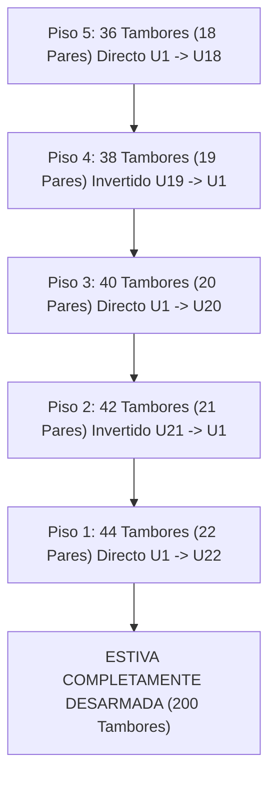

# Orden Completo de Desarmado de una Estiba de 200 Tambores (GeoStock)

Este documento detalla la **secuencia exacta de desarmado** de una estiba completa de 200 tambores de miel (ejemplo `E39`), aplicando la regla **LIFO (Last-In, First-Out)** de arriba hacia abajo y respetando el patrón de **trabado alternado (Zig-Zag)** en pisos pares.

---

## 1. Reglas Inviolables de Desarmado

1.  **Orden Descendente de Pisos (LIFO Vertical)**:
    *   No se puede retirar ningún tambor de un piso inferior mientras existan tambores en un piso superior.
    *   Secuencia de Pisos: **P5 $\rightarrow$ P4 $\rightarrow$ P3 $\rightarrow$ P2 $\rightarrow$ P1**.
2.  **Retiro en Pares Obligatorios**:
    *   Cada celda se desarma retirando su pareja de tambores completa (compartiendo el mismo `pairId`).
3.  **Dirección de Ubicación (`U`) por Piso**:
    *   **Pisos Impares (`P5`, `P3`, `P1`)**: Conteo en orden **directo** (`U1` $\rightarrow$ `U_Max`).
    *   **Pisos Pares (`P4`, `P2`)**: Conteo en orden **invertido / Zig-Zag** (`U_Max` $\rightarrow$ `U1`).

---

## 2. Secuencia Paso a Paso de las 100 Parejas (200 Tambores)

---

### ETAPA 1: Piso 5 / Nivel Superior (`P5`) — 36 Tambores (18 Pares)
*Sentido: Directo (`U1` a `U18`)*

1.  `E39-D-P5-U1` y `E39-I-P5-U1` (Par 1)
2.  `E39-D-P5-U2` y `E39-I-P5-U2` (Par 2)
3.  `E39-D-P5-U3` y `E39-I-P5-U3` (Par 3)
4.  ...
18. `E39-D-P5-U18` y `E39-I-P5-U18` (Par 18)
*Subtotal acumulado desarmado: 36 tambores.*

---

### ETAPA 2: Piso 4 (`P4`) — 38 Tambores (19 Pares)
*Sentido: Invertido / Zig-Zag (`U19` a `U1`)*

19. `E39-D-P4-U19` y `E39-I-P4-U19` *(Ejemplo real de captura: Par 19)*
20. `E39-D-P4-U18` y `E39-I-P4-U18`
21. `E39-D-P4-U17` y `E39-I-P4-U17`
22. ...
37. `E39-D-P4-U1` y `E39-I-P4-U1`
*Subtotal acumulado desarmado: 74 tambores.*

---

### ETAPA 3: Piso 3 (`P3`) — 40 Tambores (20 Pares)
*Sentido: Directo (`U1` a `U20`)*

38. `E39-D-P3-U1` y `E39-I-P3-U1`
39. `E39-D-P3-U2` y `E39-I-P3-U2`
40. ...
57. `E39-D-P3-U20` y `E39-I-P3-U20`
*Subtotal acumulado desarmado: 114 tambores.*

---

### ETAPA 4: Piso 2 (`P2`) — 42 Tambores (21 Pares)
*Sentido: Invertido / Zig-Zag (`U21` a `U1`)*

58. `E39-D-P2-U21` y `E39-I-P2-U21` *(Ejemplo real de captura: Par 21)*
59. `E39-D-P2-U20` y `E39-I-P2-U20`
60. ...
78. `E39-D-P2-U1` y `E39-I-P2-U1`
*Subtotal acumulado desarmado: 156 tambores.*

---

### ETAPA 5: Piso 1 / Base Inferior (`P1`) — 44 Tambores (22 Pares)
*Sentido: Directo (`U1` a `U22`)*

79. `E39-D-P1-U1` y `E39-I-P1-U1` *(Ejemplo real de captura: Par 1)*
80. `E39-D-P1-U2` y `E39-I-P1-U2`
81. ...
100. `E39-D-P1-U22` y `E39-I-P1-U22`
*TOTAL FINAL DESARMADO: 200 TAMBORES (100 PARES). ESTIVA TOTALMENTE VACÍA.*
