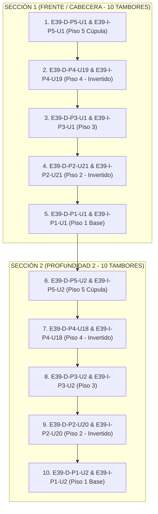

# Secuencia Real de Desarmado de Estivas por Cabecera (GeoStock)

Este documento detalla la **secuencia física real de desarmado por cabecera/sección vertical** de una estiba completa de 200 tambores (ej. `E39`), tal como la opera un autoelevador (clarkista) desde el frente del pasillo de depósito.

---

## 1. Lógica Operativa de Desarmado por Cabecera

Físicamente, un autoelevador en depósito no puede volar ni avanzar a lo largo de una estiba profunda de 30 metros de largo sin despejar el acceso.

Por esta razón, el desarmado se realiza **de cabecera a fondo por cortes verticales**:
1. El autoelevador se ubica en el frente del pasillo (`U1` / Cabecera).
2. Desmonta la primera columna vertical del frente **de arriba hacia abajo** (Piso 5 $\rightarrow$ Piso 4 $\rightarrow$ Piso 3 $\rightarrow$ Piso 2 $\rightarrow$ Piso 1).
3. Una vez despejado el suelo de esa primera sección (`U1`), el camión avanza un paso y desmonta la segunda sección (`U2`), repitiendo el proceso vertical de cúpula a piso base.

---

## 2. Lista Exacta de las Primeras 20 Posiciones a Retirar

A continuación se detalla la lista exacta de las **primeras 20 posiciones (10 parejas de tambores)** que retirará el autoelevador al desarmar la estiba `E39` de 200 tambores:

### Detalle de las 20 Posiciones:

| N° Orden | Posición Exacta en Sistema | Piso / Elevación | Lado | Unidad | Sección / Profundidad |
| :---: | :---: | :---: | :---: | :---: | :---: |
| **1** | `E39-D-P5-U1` | **Piso 5 (Cúpula)** | Derecho | U1 | **Sección 1 (Frente)** |
| **2** | `E39-I-P5-U1` | **Piso 5 (Cúpula)** | Izquierdo | U1 | **Sección 1 (Frente)** |
| **3** | `E39-D-P4-U19` | **Piso 4** | Derecho | U19 (Frente) | **Sección 1 (Frente)** |
| **4** | `E39-I-P4-U19` | **Piso 4** | Izquierdo | U19 (Frente) | **Sección 1 (Frente)** |
| **5** | `E39-D-P3-U1` | **Piso 3** | Derecho | U1 | **Sección 1 (Frente)** |
| **6** | `E39-I-P3-U1` | **Piso 3** | Izquierdo | U1 | **Sección 1 (Frente)** |
| **7** | `E39-D-P2-U21` | **Piso 2** | Derecho | U21 (Frente) | **Sección 1 (Frente)** |
| **8** | `E39-I-P2-U21` | **Piso 2** | Izquierdo | U21 (Frente) | **Sección 1 (Frente)** |
| **9** | `E39-D-P1-U1` | **Piso 1 (Base)** | Derecho | U1 | **Sección 1 (Frente)** |
| **10** | `E39-I-P1-U1` | **Piso 1 (Base)** | Izquierdo | U1 | **Sección 1 (Frente)** |
| **11** | `E39-D-P5-U2` | **Piso 5 (Cúpula)** | Derecho | U2 | **Sección 2 (Avanza)** |
| **12** | `E39-I-P5-U2` | **Piso 5 (Cúpula)** | Izquierdo | U2 | **Sección 2 (Avanza)** |
| **13** | `E39-D-P4-U18` | **Piso 4** | Derecho | U18 | **Sección 2 (Avanza)** |
| **14** | `E39-I-P4-U18` | **Piso 4** | Izquierdo | U18 | **Sección 2 (Avanza)** |
| **15** | `E39-D-P3-U2` | **Piso 3** | Derecho | U2 | **Sección 2 (Avanza)** |
| **16** | `E39-I-P3-U2` | **Piso 3** | Izquierdo | U2 | **Sección 2 (Avanza)** |
| **17** | `E39-D-P2-U20` | **Piso 2** | Derecho | U20 | **Sección 2 (Avanza)** |
| **18** | `E39-I-P2-U20` | **Piso 2** | Izquierdo | U20 | **Sección 2 (Avanza)** |
| **19** | `E39-D-P1-U2` | **Piso 1 (Base)** | Derecho | U2 | **Sección 2 (Avanza)** |
| **20** | `E39-I-P1-U2` | **Piso 1 (Base)** | Izquierdo | U2 | **Sección 2 (Avanza)** |

---

> [!NOTE]
> Al completar estas **primeras 20 posiciones**, el autoelevador ha despejado totalmente las 2 primeras columnas verticales en la entrada del pasillo (20 tambores de 200 desarmados) y puede continuar con la Sección 3 (`U3`, `U17`, `U3`, `U19`, `U3`).
