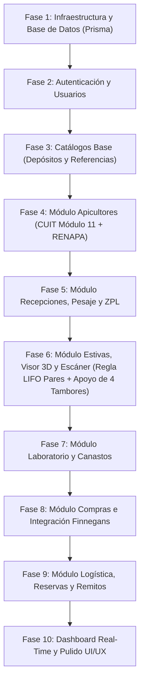

# Plan de Implementación Paso a Paso para GeoStock (GeoMiel)

Este documento sirve como la **hoja de ruta secuencial obligatoria** para que cualquier agente de IA o desarrollador pueda construir y desplegar la réplica exacta del sistema GeoStock desde cero, asegurando que las dependencias de base de datos y lógica de negocio se implementen en el orden más conveniente.

---

## Fases de Construcción Secuencial

---

### Paso 1: Base de Datos e Infraestructura
1. Configurar la conexión a **PostgreSQL** en el archivo `.env`.
2. Ejecutar `npx prisma db push` sobre [schema.prisma](backend/prisma/schema.prisma) para generar automáticamente las **25 tablas**, tipos enum y relaciones relacionales.
3. Ejecutar `npx prisma generate` para tener el cliente de `@prisma/client` completamente tipado.

### Paso 2: Autenticación y Gestión de Usuarios
1. Crear el controlador de login (`POST /api/auth/login`) con hashing de contraseñas (bcrypt) y generación de cookie de sesión (`geomiel_sid`).
2. Crear middleware de autenticación que inyecte `req.user` conteniendo `enabledModules`, `role`, `area` y la bandera `idGeomielObligatorio`.
3. Implementar `/api/auth/me` y `/api/auth/logout`.

### Paso 3: Catálogos Base e Inventario de Referencia
1. Sembrar o poblar vía API la tabla `RangoColor` con los rangos comerciales (`0-15`, `41-45`, `+70`) incluyendo sus límites `min` y `max`.
2. Implementar el ABM de **Depósitos** (`Warehouse`) (`/api/almacenes`).
3. Implementar el ABM de **Referencias** (`Referencia`) (`/api/almacenes/referencias`).

### Paso 4: Módulo de Apicultores
1. Implementar la validación algorítmica de **CUIT Módulo 11** en el backend para denegar CUITs inválidos antes de tocar la base de datos.
2. Implementar la creación y consulta de Apicultores (`/api/apicultores`).
3. Conectar el servicio de consulta y auditoría de **RENAPA** (`/api/apicultores/:id/validar` y `/api/renapa/consultar/:cuit`).

### Paso 5: Recepción, Registro de Tambores, Pesaje y ZPL
1. Crear el ABM de **Recepciones** (`/api/recepciones`).
2. Implementar el registro de tambores (`/api/barrels`) asociando el código de barra interno (ej: `G-2026-000029`) e ID de recepción.
3. Implementar el submódulo de pesaje de balanza (`/api/barrels/pesaje/buscar` y `/api/barrels/pesaje/:id/confirmar`).
4. Implementar el generador de etiquetas térmicas **ZPL** (`GET /api/barrels/:id/etiqueta`) para impresoras Zebra.

### Paso 6: Armado/Desarmado de Estivas, Visor 3D y Escáner (Regla de 4 Tambores de Base)
1. Implementar la creación de celdas físicas de estiba (`/api/estivas`).
2. Implementar el cálculo de **capacidad piramidal** ($\text{Capacidad Nivel } s = \max(0, \text{baseCapacity} - (s - 1) \times 2)$) resultando en 200 tambores para base 44 y 5 niveles.
3. Implementar el formateador de posiciones cortas en lenguaje humano `[Estiba]-[Lado]-P[Piso]-U[Ubicación]` (ejemplo real: `E39-D-P1-U1`, `E39-D-P2-U21`, `E39-D-P4-U19`), aplicando el sentido invertido/zig-zag en pisos pares (`P2`, `P4`).
4. **Regla Física de Apoyo de 4 Tambores**: Implementar la validación en `/api/scan/armado` que exige tener colocados los 2 pares inferiores (ej. `P1-U22` y `P1-U21`) antes de permitir colocar el par en elevación (`P2-U1`). En caso contrario, arrojar el error: `"Faltan tambores de apoyo en el nivel inferior"`.
5. Implementar la API predictiva de sugerencia de celda libre (`/api/scan/suggest/:estivaId`) siguiendo el avance intercalado triangular en escalera.
6. Implementar el endpoint `/api/scan/armado` obligando a recibir tambores **de a pares (2 tambores)** asignando un `pairId`.
7. Implementar la regla de desarmado por cabecera `/api/scan/desarmado/suggest/:estivaId` y la validación en `/api/scan/desarmado` arrojando los errores estrictos: `"Retirás primero tambores superiores"` y `"[Código] no es el par del primero. Escaneá el compañero."`.

### Paso 7: Módulo de Laboratorio y Canastos
1. Crear órdenes de laboratorio (`/api/laboratorio/iniciar`).
2. Muestreo físico-químico (color, humedad, HMF) y aprobación (`/api/laboratorio/muestras/:id`).
3. Módulo de agrupar muestras en **Canastos** (`/api/laboratorio/canastos`).

### Paso 8: Módulo de Compras, Liquidaciones e Integración ERP
1. Registro de Emisores fiscales (`/api/compra/emisores`).
2. Asignación de tambores a Órdenes de Compra (`/api/compra/ordenes/:id/tambores`).
3. Cálculo dinámico de la liquidación cruzando kg netos y precios por calidad (`CLARA`, `INTERMEDIA`, `OSCURA`).
4. Emisión de facturas (`/api/compra/ordenes/:id/facturas`).
5. Push de integración al ERP **Finnegans** (`/api/compra/ordenes/:id/finnegans/push`).

### Paso 9: Logística, Reservas de Stock y Remitos Digitales
1. ABM de Choferes, Solicitudes Logísticas y Cargas (`/api/logistica/...`).
2. Motor de **Reservas de Stock** (`/api/logistica/reservas`) y cálculo de disponible real (`/api/logistica/stock-disponible`).
3. Emisión de remitos y captura de **Firma Digital** (`/api/logistica/remitos/:id/firma`).

### Paso 10: Dashboard Real-Time y Estética UI/UX
1. Mapear las telemetrías y estadísticas en `/api/dashboard/stats`.
2. Estilizar la aplicación en React siguiendo el tema oscuro `#08090A`, la tipografía **Commit Mono** para códigos/pesos, e interactivos con Radix UI + Tailwind CSS.
